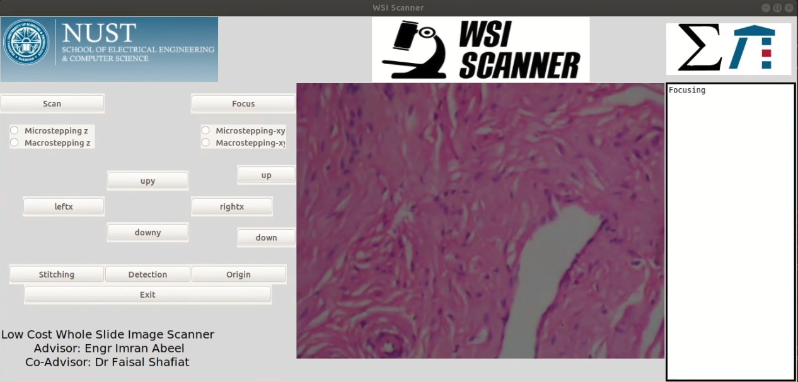

## Graphical User Interface 

This Repo contains Graphical User Interface based on tkinter with serial code intergrated for embedded hardware.
This Gui supports following functionalities:
1. Motor Control
2. Auto Focus
3. Stitching
4. Detection(Yolo based detection was integrated but has been removed, please integrate your own detection model)

Here is how it looks:

